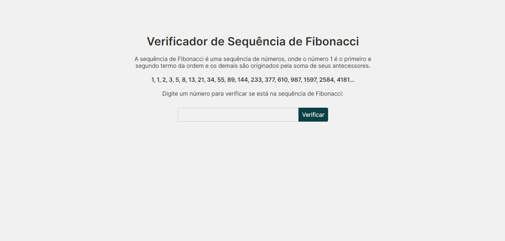
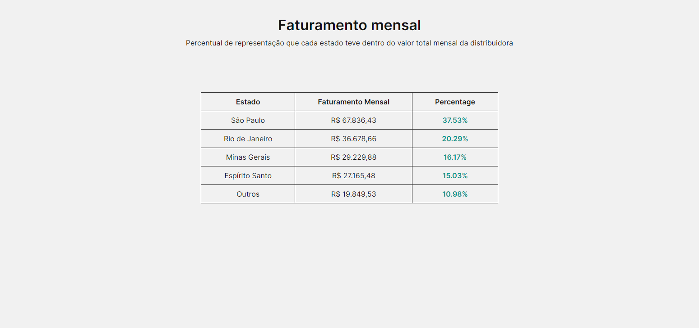
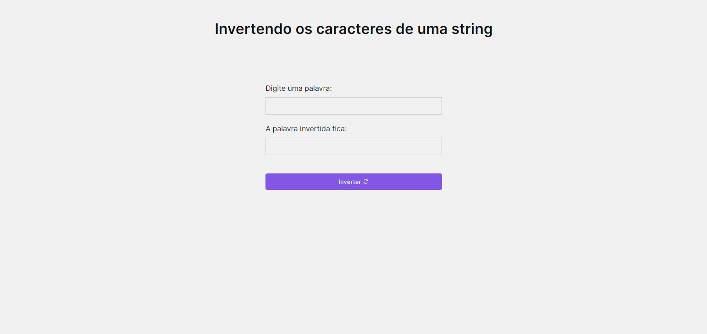

<h1 align="center">📝 Exercises Rotation</h1>

  
Dado a sequência de Fibonacci, onde se inicia por 0 e 1 e o próximo valor sempre será a soma dos 2 valores anteriores (exemplo: 0, 1, 1, 2, 3, 5, 8, 13, 21, 34...), escreva um programa na linguagem que desejar onde, informado um número, ele calcule a sequência de Fibonacci e retorne uma mensagem avisando se o número informado pertence ou não a sequência.

  

  

    Escreva um programa na linguagem que desejar onde calcule o percentual de representação que cada estado teve dentro do valor total mensal da distribuidora.

      SP – R$67.836,43
      RJ – R$36.678,66
      MG – R$29.229,88
      ES – R$27.165,48
      Outros – R$19.849,53
  

  

  
 Escreva um programa que inverta os caracteres de um string.

  

## Linguagens: 🚀
- HTML
- CSS
- JavaScript
